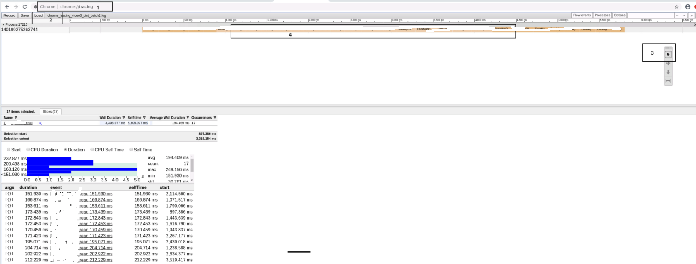

# python实战08多线程性能分析(装饰器和chromeTrace)
## 需求
多线程开发时，需要进行性能分析时，希望查看各线程（进程的执行时序图）  
类似如下效果  
  


## 转化脚本和使用方法
如下代码将在error.log（添加到debug.log可能更合理）中添加部分日志,当然,生成的日志无法直接用chrome tracing绘制时序图，但经过转化脚本后则可以  
  

使用方式01，装饰器  
```
@cal_time(name=xx)
def func_run(txt):
    print('txt:%s' % txt)
```
使用方式02，直接使用  
  

仅仅使用如上方式，可以在日志中得到func的开始和结束时间  
需要转为chrome trace支持的数据格式，进行进一步分析  
## 转化脚本
借助如下sed脚本可以将数据转为chrome trace支持的格式  
  

转换格式后如下  
```
[ 
    {"name": "出方案", "ph": "B", "pid": "Main", "tid": "工作", "ts": 0},
    {"name": "出方案", "ph": "E", "pid": "Main", "tid": "工作", "ts": 28800000000}, 
    {"name": "看电影", "ph": "B", "pid": "Main", "tid": "休闲", "ts": 28800000000},
    {"name": "看电影", "ph": "E", "pid": "Main", "tid": "休闲", "ts": 32400000000},
    {"name": "写代码", "ph": "B", "pid": "Main", "tid": "工作", "ts": 32400000000},
    {"name": "写代码", "ph": "E", "pid": "Main", "tid": "工作", "ts": 36000000000},
    {"name": "遛狗", "ph": "B", "pid": "Main", "tid": "休闲", "ts": 36000000000},
    {"name": "遛狗", "ph": "E", "pid": "Main", "tid": "休闲", "ts": 37800000000}
]
```
## 使用chrome tracing分析
使用chrome tracing分析  
效果示意图:  
  
可以统计出总时间区间个数，最大值，最小值 和平均时间等信息  

另一个例子:一个大方法内部各子步骤时序图样例  
  

## 参考
多线程程序性能分析：none  
多线程程序性能分析工具：none  
vtune性能分析工具--找出程序性能瓶颈：https://blog.csdn.net/pzhw520hchy/article/details/79823038  
valgrind的callgrind工具进行多线程性能分析：https://www.cnblogs.com/zengkefu/p/5642991.html  
python多线程程序性能分析工具：none  
python多线程 性能分析：none  
python中如何理解装饰器代码？：https://www.zhihu.com/question/65229244  
强大的可视化利器 Chrome Trace Viewer 使用详解:https://limboy.me/2020/03/21/chrome-trace-viewer/  
